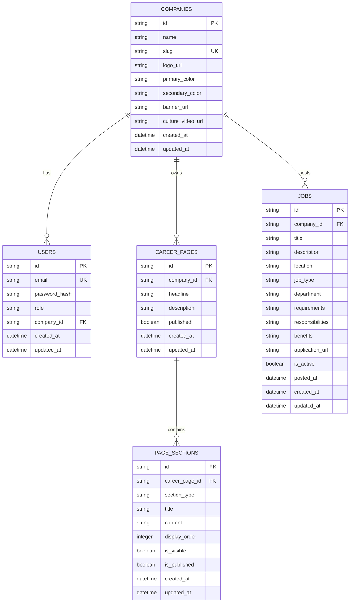

# Technical Specification: Multi-Tenant ATS Careers Page Builder

## 1. Problem Statement
Modern enterprises require distinct, high-fidelity careers portals that reflect employer brand identity while maintaining deep structural consistency and searchability for open positions. Recruiting teams need agility to iterate on copy, company values, culture videos, and open roles without engineering bottlenecks, while guaranteeing that draft modifications never compromise live public vacancy boards.

---

## 2. Goals & Non-Goals

### Goals
- **Multi-Tenant Isolation**: Completely segregate tenant company data, recruiters, career pages, sections, and open jobs.
- **Dynamic Modular Builder**: Empower recruiters to add, configure, hide, delete, and reorder modular page sections (Hero, About Us, Values, Life at Company, Culture, Benefits, Open Positions).
- **Draft vs. Published Model**: Ensure clear transactional boundaries between internal drafts and published candidate-facing portals.
- **Candidate Discovery**: Provide instant, composite search and filtering (by keyword, location, job type).
- **Accessibility & SEO**: Semantic HTML hierarchy, WCAG 2.1 AA keyboard navigation (including accessible section reordering without external drag-and-drop dependencies), and automatic Google `JobPosting` JSON-LD schema injection.

### Non-Goals
- Full applicant tracking workflow (e.g. resume parsing, interview scheduling). Candidates are directed to external ATS application links via an Apply CTA.
- Direct file storage/media hosting microservices (URLs for logos/banners/videos are accepted).

---

## 3. Technology Stack & Rationale

```
+-------------------------------------------------------------------------+
|                               FRONTEND                                  |
|   React 18 + Vite + Tailwind CSS + Lucide Icons + React Router DOM v6   |
+-------------------------------------------------------------------------+
                                    │
                                    │ REST APIs / Bearer JWT
                                    ▼
+-------------------------------------------------------------------------+
|                                BACKEND                                  |
|         FastAPI + Pydantic v2 + SQLAlchemy 2.0 ORM + python-jose        |
+-------------------------------------------------------------------------+
                                    │
                                    │ Connection Pooling / SSL
                                    ▼
+-------------------------------------------------------------------------+
|                               DATABASE                                  |
|             PostgreSQL / Neon (Cloud) & SQLite (Local / Test)           |
+-------------------------------------------------------------------------+
```

- **Frontend**: React + Tailwind CSS allows maximum layout flexibility, rapid component reusability, zero CSS runtime overhead, and responsive styling without heavyweight UI kits.
- **Backend**: FastAPI delivers native async performance, automatic OpenAPI documentation, and strict schema validation via Pydantic v2.
- **Database**: PostgreSQL / Neon ensures relational integrity, ACID transactions, and foreign key cascading. SQLite provides zero-dependency test isolation.
- **Auth**: Stateless JSON Web Tokens (JWT) signed with HMAC-SHA256.

---

## 4. Database Schema Design

### Entity Relationship Diagram


---

## 5. Multi-Tenancy & Security Strategy

### Tenant Boundary Enforcement
- **Identity Derivation**: Recruiter identity and company affiliation (`company_id`) are decoded exclusively from the cryptographically verified JWT payload on the backend.
- **Ownership Verification**: All mutative endpoints (`PUT /api/company/me/jobs/{id}`, `DELETE /api/company/me/sections/{id}`, etc.) perform strict verification:
  ```python
  if job.company_id != current_user.company_id:
      raise ForbiddenError("Access forbidden: You do not own this job")
  ```
- **Cross-Tenant Access Prevention**: A recruiter from Company A attempting to access or modify resources belonging to Company B receives an immediate `403 Forbidden` response.

---

## 6. Page Builder & Accessible Section Reordering
Rather than relying on brittle, heavy drag-and-drop libraries (such as `dnd-kit` or `react-dnd`), the page builder implements:
1. **Keyboard-Accessible Reorder Controls**: Up and Down arrow controls with distinct ARIA labels (`aria-label="Move Section Up"`) allowing seamless screen-reader and keyboard-only operation.
2. **Deterministic Sequence Ordering**: Sections maintain a zero-indexed `display_order` column. Reordering transactions update all target indices atomically in a single batch request to `/api/company/me/sections/reorder`.

---

## 7. Draft vs. Published State Management
- When recruiters modify sections, company branding, or page headlines, changes remain in **Draft** state.
- Sections feature both `is_visible` (draft visibility) and `is_published` (public visibility) flags.
- Calling `POST /api/company/me/careers/publish` promotes the current draft configuration to live status and flips `career_pages.published = true`.
- Calling `POST /api/company/me/careers/unpublish` immediately marks `career_pages.published = false`, causing subsequent public queries to return a clean `404 Not Found`.

---

## 8. SEO, Crawlability & Accessibility

### SEO Architecture
- Dynamic title and meta descriptions updated reactively based on company and job context.
- **Google JobPosting Schema (JSON-LD)** dynamically injected on job detail pages containing:
  - `title`, `description`, `datePosted`, `employmentType`
  - `hiringOrganization` (name, logo, URL)
  - `jobLocation` (locality, remote indicators)

### Accessibility (WCAG 2.1 AA)
- High contrast color ratios on all text and UI containers.
- Visible focus rings (`focus:ring-2 focus:ring-blue-600 focus:ring-offset-2`).
- Semantic HTML tags (`<header>`, `<main>`, `<section>`, `<footer>`, `<h1>`-`<h3>`).
- Fully accessible form controls with corresponding `<label for="...">` associations.

---

## 9. Performance & Scalability Considerations
- **Stateless Application Servers**: FastAPI instances maintain no session state, allowing horizontal scaling behind load balancers.
- **Database Connection Pooling**: Built-in SQLAlchemy engine pool recycling with `pool_pre_ping=True` and bounded overflow for cloud databases like Neon.
- **PostgreSQL Indexing**:
  - `companies.slug` (Unique B-tree index for O(1) public lookups)
  - `jobs.company_id` and `jobs.is_active` (Composite indexing for filtered candidate queries)
  - `page_sections.career_page_id` and `page_sections.display_order` (Ordered traversal index)
